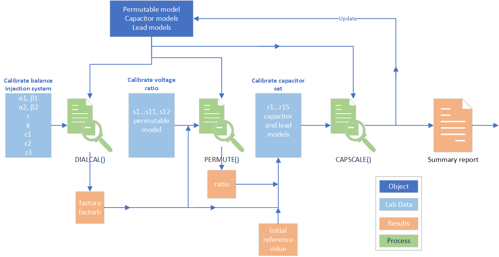
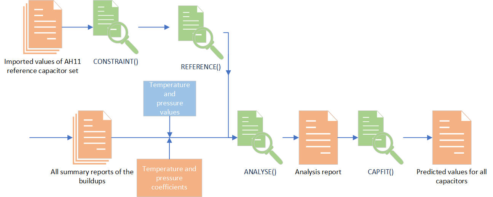

This guide explains where and how to enter the data required for processing with the Python software collected in the CapacitanceScale project. Details of the code are not described here. While significant improvements to the software are planned this manual focuses on the current state when MSLT.E.005.04 is validated, ideally matching a GitHub release version.  The general flow of data gathering and processing is shown below where the light green processes are labelled with the key Python class that implements the process.

This software version has evolved (since E.005.03) to incorporate temperature and pressure corrections, alternative balance schemes for the 0.5 pF capacitor, batch processing of historical data, graphing of data, fitting to data to facilitate short term prediction of capacitor values. This replaces analysis steps previously carried out in Excel spreadsheets. Extensive use of intermediate csv files means that spreadsheet views can be generated if required. The figure below captures these additional processes.

Components
==========
For each capacitance scale buildup, the current basic characteristics of the key components need to be available. These characteristics are generally measured with an LCR meter.

Capacitors
----------
Measurements are carried out on capacitors defined as two terminal-pair components. It is assumed that the admittances to case, both at the high and low voltage terminals (yhv and ylv) are relatively stable with time so do not need routine remeasurement. These admittances only have a second-order impact on the two terminal-pair value of the capacitor.
A CAPACITOR object is defined in *components.py* with a name, nominal capacitance value (capacitance, conductance), yhv (capacitance, conductance), ylv (capacitance, conductance), angular frequency, relative uncertainty (of yhv and ylv), and the option of key word arguments.
CAPACITOR objects are created by running *create_component.py* that stores the objects in a csv file. The values are hard coded in the *create_capacitors()* method and so the code needs modification if new values are required.
The ‘best value’ of a CAPACITOR will be updated after analysing the results of a scale buildup, but the port admittances remain unaltered.

Leads
-----
Bridge components are connected by coaxial cables that are treated as two-port networks implemented as LEAD objects in components.py. Each lead has a name, short-circuit series impedance, open-circuit admittance, angular frequency, and a common relative uncertainty for the two values.
LEAD objects are created by running *create_component.py* that stores the objects in a csv file. The values are hard coded in the *create_leads()* method, and the objects are stored in the same csv file as the CAPACITOR objects.
Note that the 100:1 transformer is treated as a LEAD object when it is placed in series with the capacitor on the low voltage side of the capacitance bridge.
For each set of ratio measurements when building up the scale there needs to be a corresponding comp_leads_caps_yyy-mm-dd.csv file.

Permutable Capacitor
--------------------
While the permutable capacitor is essentially a set of two terminal-pair capacitors, its internal switching makes it unique, and its relevant parameters are hard-coded in the *create_permutable()* method CREATOR of *create_component.py* and stored in comp_permute_yyyy-mm-dd.csv. Note that the values of the individual permutable capacitors do change over time. It is efficient to update these directly in the csv file.

Calibration
===========

Balance Injection
-----------------
Calculating the correction factors for the balance injection dials is done by *cal_balance.py* using data entered in the file dialcal_in_yyyy-mm-dd.csv. There is no script for creating this file, but it does not take long to edit a previous version with the IVD settings, the measured dc value of the Thompson resistor and its parallel capacitance. Be careful not to change any of the quotation marks as they are critical for correctly reading the dictionary.

.. code-block::

  Date,07-Jul-25
  Reference,E005 Cap. Scale, p.64, 100k #4
  w,1.00E+04
  alpha1,"{""x"": 0.999759, ""u"": 2e-06, ""df"": Infinity, ""label"": ""alpha1""}"
  beta1,"{""x"": -0.000658, ""u"": 2e-06, ""df"": Infinity, ""label"": ""beta1""}"
  alpha2,"{""x"": -0.002058, ""u"": 2e-06, ""df"": Infinity, ""label"": ""alpha2""}"
  beta2,"{""x"": 1.002480, ""u"": 2e-06, ""df"": Infinity, ""label"": ""beta2""}"
  r,0.01
  k,0.2
  c1,es14
  c2,gr1000a
  label y3,100k4
  r3,100.198225e3
  ur3,0.1
  c3,0.028e-12
  uc3,0.001e-12

Main Transformer 10:1 Calibration
---------------------------------
There are 12 sets of dial readings (alpha, beta) labelled s1 to s12, one for each of the eleven switch settings and a final repeat of the first switch setting. Each dial reading is entered as a number where ’ X’ in the first dial is equivalent to 1.0. Positive settings do not have a ‘+’ sign while negative settings do have the ‘-‘ sign. There is no space following any of the commas. The first line is the date, the second line a free form description of where to find the original manual entry, the third line is the angular frequency (always 1e4). The file name is in the format ‘ratio_cal_in_yyyy-mm-dd.csv’.

.. code-block::

 Date,4 October 2019
 Reference,KJ Lab Diary2 p.103
 w,1e4
 s1,-0.165950,0.168400
 s2,0.091620,0.169830
 s3,0.112840,0.168200
 s4,-0.000240,0.171100
 s5,0.250430,0.164400
 s6,-0.009850,0.167500
 s7,-0.088980,0.168590
 s8,-0.024880,0.170900
 s9,-0.136700,0.170220
 s10,-0.202040,0.168710
 s11,-0.016080,0.168960
 s12,-0.165950,0.167360

It is most efficient to copy a previous set and to edit the date, reference and numbers. The csv reader is unforgiving of extra spaces or unexpected characters (e.g. +).

Scale Buildup Measurements
==========================

Ratio Measurements
------------------
There is no flexibility in the software for including capacitance ratios or capacitors other than those described in the procedure, r_1 to r_15, and the connecting leads must be as in the procedure. The only connection variations accommodated are for the measurement of the 0.5 pF capacitor, ES14. Lab book data is transferred to a file named ‘capcal_in_yyyy-mm-dd.csv’. The format is similar to the permutable file but note the three options for the 0.5 pF measurement that are entered on the second line. Do not put a space after the comma.

1.	Reference,p 88 E005 cap scale
2.	Reference,p 88 E005 cap scale,cap inject 5
3.	Reference,p 88 E005 cap scale,cap inject 10

Option 1 is for earlier measurements with the in-line 100:1 transformer.

Option 2 is for the now usual use of the alternative sapphire ball 5 pF capacitor being connected to the 10:1 transformer.

Option 3 is for the one occasion when the General Radio 10 pF capacitor was used

.. code-block::

    Date,21-Nov-25
    Reference,p 88 E005 cap scale,cap inject 5
    w,1.00E+04
    r1,-0.113983,0.016387
    r2,-0.081583,0.016357
    r3,0.090573,-0.138057
    r4,0.011073,-0.152057
    r5,0.013603,-0.164357
    r6,0.012143,-0.140357
    r7,0.010363,-0.141017
    r8,0.214803,-0.163567
    r9,0.011163,-0.150847
    r10,0.009163,-0.145777
    r11,0.012863,-0.160247
    r12,0.002663,-0.157847
    r13,-0.418463,-0.154957
    r14,-0.327003,-0.106067
    r15,-0.157873,-0.103697
    Conditions
    AH1,29.9,0.029
    AH2,29.4,0.029
    GRin,23.63237,0.000199
    GRout,23.60632,0.000198
    AB1,21.05,0.01
    Sball,23.45592,0.002913
    Perm,23.14318,0.001711
    Barom,1019.63,0.01

The lower section of the csv file has the values of the influence variables in the format

Name, value, standard uncertainty

At present the AB1 (air bath 1) is just a placeholder with a dummy value. The ‘GRout’ and ‘Perm’ values are not used in the calculation.

Influence Variables
-------------------
It is essential that the temperatures of the two AH11s, the inner temperature of the General Radio enclosure, the temperature of the sapphire ball oil bath and the atmospheric pressure are recorded during the buildup measurements.
It is acceptable to rely on manual readings of the front panel display of the AH11 chassis temperatures and the screen display of the Vaisala barometer.
Other temperatures are logged from a multiplexed HP34970 meter using a local Windows 7 laptop. It is essential that this system is operating, preferably on the 5-minute interval, while measurements are being made. At present the SQLite database file is ‘cap_environment_May_2022_on.db’ and this should be copied off the laptop before starting the analysis of the measurements. The caplogger2014 project uses sql_cap.py to extract the values in a specified range, e.g.

.. code-block::
 date_tuples_2 = [('19 September, 2019, 9:00 AM', '19 September, 2019, 4:00 PM')]
 sql = SQLDATA('LoggerData\cap_environment_August_2019_on.db')

The text output from running *sql_cap.py* is pasted into the ‘text_python_console’ worksheet of caplogger.xlsx before being manually pasted, number by number, into the ‘table’ worksheet. This spreadsheet maintains a record of the buildup runs in the ‘buildups’ worksheet. This spreadsheet is the source for manual entry into ‘capcal_in_yyyy-mm-dd.csv’.
Direct editing of the code is required to enter new date ranges.
The code is available at metrologist/caplogger2014: Legacy logging system for a set of precision capacitors.

Influence Coefficients
----------------------
Estimations of temperature and pressure coefficients have been made for several of the capacitors.

Temperature coefficients for AH11#1 are recorded in Electricity\Ongoing\Farad\ImportingCapacitance\AH11_properties.xlsx. The AH11#2 temperature coefficients have not been measured. The AH11#1 coefficients are hard coded in the REFERENCE class of reference.py, along with the external calibration values that underpin the whole capacitance scale.

Temperature and pressure coefficients for the General Radio and sapphire ball capacitors have been estimated in Electricity\Ongoing\Farad\LabShift\AH2700A checks KJ_GH.xlsx, from fits shown on the ‘Summary’ worksheet. These estimates have been hard coded in the add_influence() method of ANALYSE in analysis.py. This is also where the standard conditions of 1000 mbar and 29 °C or 23 °C are assigned to the capacitors.

Calculation
============
The preferred approach is to calculate the whole history of buildups together with the current new run so that the latest result is easily presented in the context of the previous results. It is possible to run the individual steps in isolation but probably with some minor editing of the “if __name__ == '__main__':” part of the modules.

Data Selection
--------------
For each buildup a csv file is created that identifies the input and output files needed to complete the calculation. Naming convention for this file is main_yyyy-mm-dd.csv. This main file is structured as

.. code-block::

    Working directory,bridge_data\October2025
    Dial input,dialcal_in_2025-07-11.csv
    Dial output,dialcal_out_2025-07-11.csv
    Permutable,comp_permute_2025-02-07.csv
    Ratio input,ratiocal_in_2025-11-26.csv
    Ratio output,ratiocal_out_2025-11-26.csv
    Scale input,capcal_in_2025-12-05.csv
    Scale output,capcal_out_2025-12-05.csv
    Leads and caps,comp_leads_caps_2025-07-11.csv
    Reference,reference_val_2021-08-24.csv

The date of the main file should match the date of the capcal_in file, but there is the flexibility to choose the most appropriate data files for the dial factors etc. Note that the choice of reference (last line) is relatively unimportant as the full analysis later corrects for the most up to date values of the reference set of AH11 capacitors, however this is where the loss angle (determined by NMIA) is entered. For example reference_val_2021-08-24.csv has

.. code-block::

    w,1e4,rad/s
    cap,99.9995864e-12,pF
    ucap,0.11e-6,relative expanded uncertainty k = 2
    dfact,1.9e-6,dissipation factor S/F/Hz
    udfact,0.6e-6,S/F/Hz k=2

The most recent main csv file is then added to the files list in the ‘__main__’ part of *all_buildup.py*

.. code-block::

    files = [r'main_2019-09-19.csv',
        r'main_2019-10-04.csv',
        r'main_2019-11-15.csv',
    …
    …
    …
        r'main_2025-10-23.csv',
        r'main_2025-10-28.csv',
        r'main_2025-11-06.csv',
        r'main_2025-11-21.csv',
        r'main_2025-12-01.csv',
        r'main_2025-12-05.csv']

Results
--------
Running *all_buidlup.py* produces graphs of capacitor values and a csv file of the best estimates of the capacitance (in relative ppm) and conductance (in nano siemen) at a common temperature and pressure. These are the results that are used to provide estimates of the capacitor values between scale buildups.
The graphs (in the graph folder) are the ‘AH11set’ for the eight Andeen Hagerling capacitor and the ‘GR and S ball set’ for the eight original General Radio and sapphire ball capacitors. Each graph is produced in jpg, pdf, and pkl. The first two are fixed images but the pkl file can be viewed interactively using view.py which gives the usual matplotlib tools. The pkl file only works if it is created and viewed in the same python environment and so is not a good option for archiving. It is useful for later reviewing the results in detail without needing to rerun the entire calculation. Note that the file name needs to be entered in the code.

Traceability
============
External calibrations of the AH11#1 set of capacitors underpin the entire scale. The assumption is that the mean relative value of the four capacitors will exhibit a slow linear drift with time. External calibrations are used to estimate that drift. The calculations made in the scale buildup force the mean relative values to the predicted drift value and all the other capacitors are measured relative to that value.
External calibration values are hard coded into REFERENCE in *reference.py*. Manually entered values are highlighted in green. Note that the 2009 measurements by BIPM have been modified in response to changes in the SI. This version shows the option of artificially reducing the uncertainty by a factor of four for the most recent external calibration so that the fitted line is weighted to the most recent value.

.. code-block::

    class REFERENCE():
        def __init__(self):  # built in external calibrations
            fn_set = FUNCDICTL()
            std_temperature = 29

            cap1 = [('Mar 19 2009', (9.999950922, 0.000000400, 50, 31.4)),
                    ('Jul 20 2019', (9.9999500, 0.000000550, 50, 27.0)),
                    ('Jul 31 2025', (9.9999513, 0.00000070/4, 50, 27.75))
                    ]

            coefficient1 = 0.003086584

            equation1 = fn_set.f_dict['func1']  # FUNCDICT version

            cap2 = [('Mar 19 2009', (9.999953022, 0.000000400, 50, 31.4)),
                    ('Jul 20 2019', (9.9999526, 0.000000550, 50, 27.0)),
                    ('Jul 31 2025', (9.9999540, 0.00000070/4, 50, 27.75))
                    ]

            coefficient2 = 0.004026581

            equation2 = fn_set.f_dict['func1']  # FUNCDICT version

            cap3 = [('Mar 19 2009', (99.999557221, 0.000004000, 50, 31.4)),
                    ('Jul 20 2019', (99.999580, 0.000005500, 50, 27.0)),
                    ('Jul 31 2025', (99.999564, 0.0000070/4, 50, 27.75))
                    ]

            coefficient3 = -0.001883384

            equation3 = fn_set.f_dict['func1']  # FUNCDICT version

            cap4 = [('Mar 19 2009', (99.999548221, 0.000004000, 50, 31.4)),
                    ('Jul 20 2019', (99.999567, 0.000005500, 50, 27.0)),
                    ('Jul 31 2025', (99.999584, 0.0000070/4, 50, 27.75))
                    ]

            coefficient4 = -0.003210803
             equation4 = fn_set.f_dict['func1']  # FUNCDICT version

Future external calibrations will be required to refine the drift model.

It is convenient to use constrain.py to view the drift model and look at the consequences of altering weighting. In this case the values are entered in the ‘__main__’ part of the script.

Prediction
==========
The history of capacitor measurements as presented in the results csv file forms the basis for predicting future values. The uncertainties in the predicted values will increase over time. A repeat scale buildup is required when these uncertainties become larger than what is required, particularly for calibrating the Universal Bridge.
Values are predicted using *cap_fit.py* relying on the measurement results in analysis_dict.csv produced by all_buildup.py. Judgement is required as to whether the results of the fitted function appear reliable within the calculated uncertainty. There is an automatic adjustment of prediction uncertainty depending on the quality of the fit as determined by χ^2.
Running cap_fit.py creates a graph for each capacitor that only displays for two seconds but can be interactively viewed again using view.py. Both the jpg and pkl versions are saved in the graphs folder.
A single prediction date is hard-coded

.. code-block::

    if __name__ == '__main__':
        date_for_prediction = '19 July 2026'
        c =CAPFIT(date_for_prediction)
        dict_list = c.load_file()  # extract dictionaries
        plt.ion()  # the interactive mode must be on for close() to work
        for index in range(len(dict_list)):
            print(dict_list[index]['name'])
            c.fitting(dict_list[index])

Python Scripts
==============

