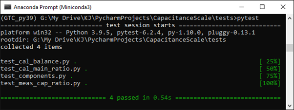

Python
------
This version is run with Python 3.9.5 and uses GTC version 1.3.4. All other packages are as supplied with Python.

Documentation
-------------
This document has been produced by sphinx 4.0.2 installed in the GTC_py39 environment. Updating this document requires
that the .rst files are updated in the /source directory of the project file. After updating these files the contents
of /build/html should be deleted. Next using the miniconda text console activate the GTC_py39 environment (where Sphinx
is installed), navigate to the project directory and run >make html. This runs make.bat that creates the document in
the /build/html folder, accessed by opening index.html. Note that restructured text files have strict format and
command requirements so remember to check that your modifications appear correctly in the new html files. Also note that
failing to delete the old html folders will result in an error when running make html. The /source directory also
contains conf.py. This can be edited to alter the source directory for the project as well as the settings for
extensions and themes used by Sphinx.

Testing
-------
The scripts and data for testing are in the testing folder. The test suite is run from the miniconda command line by
navigating to \CapacitanceScale\tests folder and running pytest.

